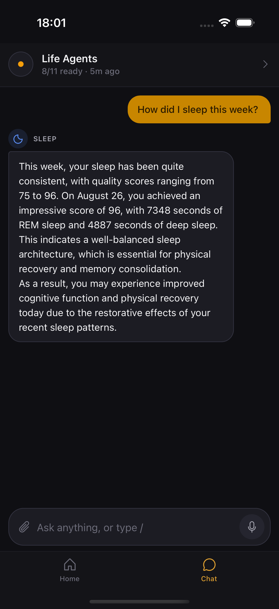
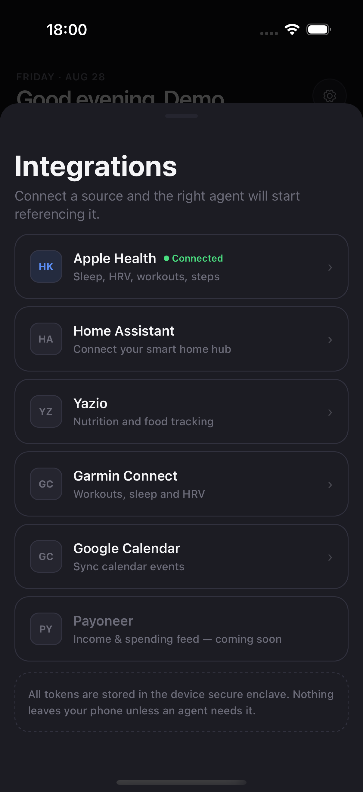
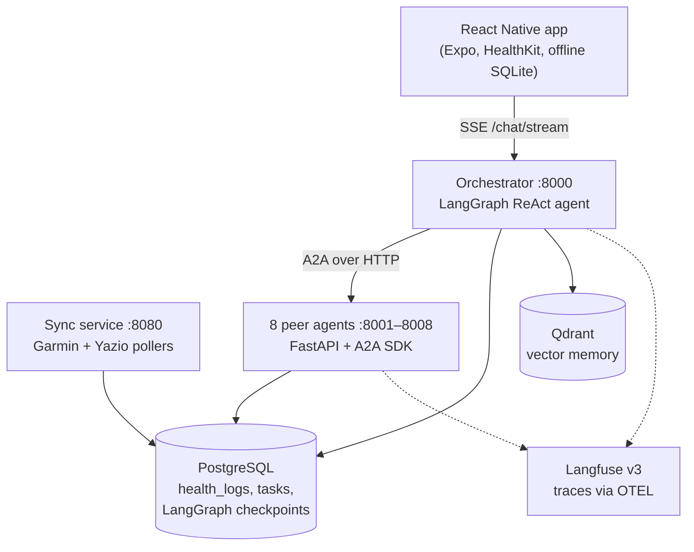

# Life Agents

A self-hosted, multi-agent health assistant. Eight specialised LLM agents — sleep,
workout, nutrition, body, mood, habits, recovery, medication — sit behind a
LangGraph orchestrator and answer questions about your own data, pulled from
Apple Health, Garmin, Yazio and Google Calendar.

Everything runs on your machine: your own Postgres, your own vector store, your
own observability stack, and the LLM provider of your choosing.

<p align="center">
  
  
  
  
</p>

## Why

Health apps each own a slice of your data and none of them talk to each other.
Garmin knows your HRV, Yazio knows your macros, Apple Health knows your steps,
and no one connects "you slept 5h20m and then ate 2 800 kcal of mostly carbs."

Life Agents puts one conversational layer over all of it. Ask *"why was my
recovery bad this week?"* and the orchestrator consults the recovery, sleep and
workout agents, each of which reads its own domain data and reports back.

## Architecture



The orchestrator is a LangGraph ReAct agent whose conversation state is
checkpointed per `thread_id` in Postgres. Peer agents are addressed with the
[A2A protocol](https://github.com/google/A2A) — each publishes an agent card,
exposes three to four domain skills, and streams artifacts back.

### The agents

| Agent | Port | What it owns |
| --- | --- | --- |
| `sleep` | 8001 | Sleep stages, duration, debt, bedtime consistency |
| `workout` | 8002 | Training sessions, load, weekly volume |
| `nutrition` | 8003 | Meals, macros, calorie balance |
| `body` | 8004 | Weight, body composition, measurements |
| `mood` | 8005 | Check-ins and a coaching loop (Groq-only, zero cost) |
| `habits` | 8006 | Habit definitions, streaks, adherence |
| `recovery` | 8007 | HRV, resting HR, readiness across domains |
| `medication` | 8008 | Medication registry, doses, adherence |

Every agent follows the same layout:

```
agents/<name>/app/
  main.py       # FastAPI + A2A request handler
  executor.py   # skill routing + LLM call
  skills.py     # AgentCard skill definitions
  prompt.py     # domain prompt builders
```

`health_logs` is the universal sink for all ingested data, deduplicated on
`(source, type, recorded_at)`.

## Integrations

| Source | Direction | Notes |
| --- | --- | --- |
| Apple Health | Push, on device | HealthKit via the mobile app; primary source for steps, HR, sleep |
| Garmin | Pull, scheduled | Per-user credentials stored in an encrypted vault |
| Yazio | Pull, scheduled | Requires your own OAuth client credentials (see below) |
| Google Calendar | Pull, on demand | Local MCP server, per-user OAuth tokens |
| Home Assistant | Pull, on demand | Optional; long-lived access token |

## Quick start

**Requirements:** Docker Desktop (or OrbStack / Colima), Node 20+, pnpm, and an
API key for one LLM provider.

```bash
cp .env.example .env      # then fill in at least one provider key
docker compose up --build -d
docker compose ps         # wait until services report healthy (~60s)
```

Smoke-check the orchestrator:

```bash
curl http://localhost:8000/agents
```

Then run the mobile app:

```bash
pnpm install
pnpm ios        # or: pnpm android
```

Full instructions, including provider-specific notes, live in
[RUNNING.md](RUNNING.md).

### Trying it without any integrations

You do not need a Supabase project, a Garmin account or an Apple Watch to see
the app working. Seed a demo user with synthetic data instead:

```bash
python scripts/seed_demo_data.py --days 28
```

Then set `AUTH_MODE=dev` in `.env`, recreate the orchestrator, and point the app
at the demo user by putting this in `apps/mobile/.env.local`:

```
EXPO_PUBLIC_API_MODE=local
EXPO_PUBLIC_API_BASE_URL=http://localhost:8000
EXPO_PUBLIC_DEV_USER_ID=de000000-0000-4000-8000-000000000001
```

`AUTH_MODE=dev` trusts an `X-User-Id` header instead of verifying a JWT. It is a
local-development convenience — never run it on anything reachable.

## Configuration

All configuration is environment-driven; see [`.env.example`](.env.example) for
the annotated list. The essentials:

| Variable | Purpose |
| --- | --- |
| `LLM_PROVIDER` | `anthropic` \| `openrouter` \| `gemini` \| `groq` \| `ollama` |
| `ANTHROPIC_API_KEY` etc. | The key matching your provider |
| `MOOD_COACH_PROVIDER` | Hard-locked to `groq`; the coach never falls back to a paid provider |
| `YAZIO_CLIENT_ID` / `YAZIO_CLIENT_SECRET` | Yazio has no public API programme — supply your own client credentials |
| `GOOGLE_CALENDAR_OAUTH_*` | A dedicated OAuth client for the mobile app |
| `TELEMETRY_ENABLED` | Turns on OTEL tracing to the bundled Langfuse stack |

> Changing `LLM_PROVIDER` or `LLM_MODEL` requires
> `docker compose up -d --force-recreate <service>` — a plain `restart` does not
> re-read `env_file`.

**No credentials are shipped in this repository.** Every key, token and secret
is read from the environment or from the per-user encrypted vault.

## Development

```bash
# Python — always use the venv; host Python 3.14 breaks langchain imports
.venv/bin/python -m pytest tests/

# TypeScript monorepo
pnpm install
turbo build
turbo test
turbo typecheck
turbo lint
```

Roughly 700 Python tests cover the agents, orchestrator routing, ingestion and
auth. A handful require a running Postgres; the rest are hermetic.

Shell smoke tests against a live stack live in `scripts/`.

## Project layout

```
agents/           8 peer agents
orchestrator/     LangGraph orchestrator and its domain modules
sync_service/     Garmin / Yazio pollers
shared/           Python shared library (LLM factory, A2A client, DB, telemetry)
apps/
  mobile/         React Native (Expo 54) — HealthKit, share extension, offline SQLite
  calendar-mcp-lite/  Google Calendar MCP server
packages/
  api-client/     OpenAPI-generated TypeScript client
  i18n/           Russian + English strings
  ui/             Shared React components
supabase/migrations/  PostgreSQL schema
tests/            Python test suite
scripts/          Smoke tests against a running stack
```

## Privacy

This is a personal health system, so the defaults lean private:

- All data stays in your own Postgres and Qdrant instances.
- Third-party credentials are held in a per-user encrypted vault, never in files.
- Tracing has three consent modes — `full`, `metadata` (token counts only), and
  `consented` (per-user opt-in). The bundled Langfuse stack is self-hosted, so
  traces never leave your machine either.
- Only the prompts you send reach your chosen LLM provider.

## Status

Personal project, actively used but not packaged for general consumption. Expect
rough edges around onboarding, and Russian-language strings in places.

## License

[Apache-2.0](LICENSE)
